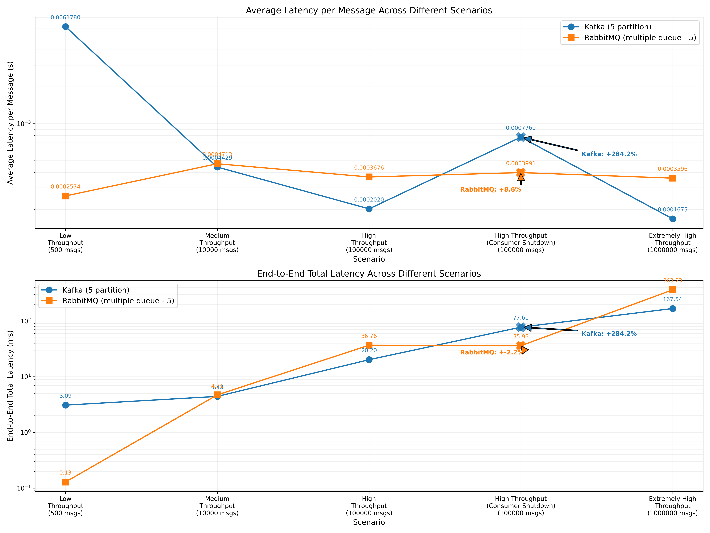
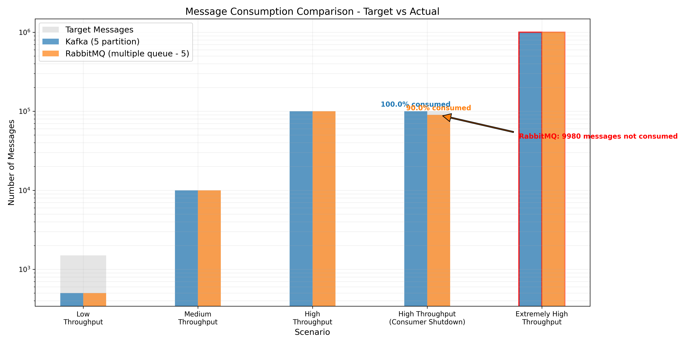

# Message Queue Benchmarking Project

This project demonstrates and compares the performance characteristics of two popular message queue systems: Apache Kafka and RabbitMQ. The benchmark suite tests different throughput scenarios and measures latency and message processing capabilities.

## Project Structure

```
.
├── benchmark/                    # Benchmarking framework
│   ├── benchmark.py              # Main benchmark orchestration
│   ├── scenario.py               # Scenario definitions
│   ├── stats.py                  # Statistics tracking
│   ├── utils.py                  # Utility functions
│   ├── visualize_benchmark.py    # Visualization tools
│   └── demo_logs/                # Benchmark results
├── message_queue/                # Message queue implementations
│   ├── interface.py              # Common interface
│   ├── factory.py                # Factory pattern implementation
│   ├── kafka.py                  # Kafka implementation
│   └── rabbitmq.py               # RabbitMQ implementation
├── main.py                       # Entry point
└── README.md                     # This file
```

## How We Demonstrate Kafka & RabbitMQ

The project uses a common interface to benchmark both Kafka and RabbitMQ under identical conditions:

1. **Common Interface**: Both implementations follow the same `MessageQueueBase` interface, ensuring fair comparisons.

2. **Docker Integration**: The system can run in both Docker and standalone environments, with appropriate broker address detection.

3. **Factory Pattern**: A message queue factory creates the appropriate implementation based on user selection.

4. **Command-line Selection**: Users can select which message queue to benchmark via command line arguments:
   ```
   python main.py --queue kafka
   python main.py --queue rabbitmq
   ```

## Infrastructure Configuration

### Docker Environment Setup

Our testing infrastructure is defined in `docker-compose.yml`, providing a consistent and isolated environment for benchmarking:

```yaml
services:
  zookeeper:
    image: confluentinc/cp-zookeeper:latest
    environment:
      ZOOKEEPER_CLIENT_PORT: 2181
      ZOOKEEPER_TICK_TIME: 2000

  kafka:
    image: confluentinc/cp-kafka:latest
    depends_on:
      - zookeeper
    ports:
      - "9092:9092"  # Internal
      - "9093:9093"  # External
    environment:
      KAFKA_BROKER_ID: 1
      KAFKA_ZOOKEEPER_CONNECT: 'zookeeper:2181'
      KAFKA_ADVERTISED_LISTENERS: PLAINTEXT://kafka:9092,PLAINTEXT_HOST://localhost:9093
      KAFKA_LISTENER_SECURITY_PROTOCOL_MAP: PLAINTEXT:PLAINTEXT,PLAINTEXT_HOST:PLAINTEXT
      KAFKA_OFFSETS_TOPIC_REPLICATION_FACTOR: 1

  rabbitmq:
    image: rabbitmq
    ports:
      - "5672:5672"
      - "15672:15672"
    environment:
      RABBITMQ_DEFAULT_USER: guest
      RABBITMQ_DEFAULT_PASS: guest
```

### Kafka Configuration

Our Kafka setup is optimized for benchmarking with these key configurations:

1. **Partitioning**: The Kafka topic uses 5 partitions, allowing for parallel message processing.
   
2. **Replication Factor**: Set to 1 for the benchmark environment (would be higher in production).
   
3. **Consumer Group**: Using a test consumer group to manage consumer offsets.
   
4. **Auto Offset Reset**: Set to "earliest" to ensure all messages are consumed during benchmarks.

5. **Dynamic Broker Detection**: Automatically detects whether to use the Docker container address or localhost.

Configuration snippet from `main.py`:
```python
config = {
    "kafka": {
        "topic": "live_demo",
        "partition": 5,
        "replication_factor": 1,
        "producer": {"bootstrap.servers": kafka_broker},
        "consumer": {
            "bootstrap.servers": kafka_broker,
            "group.id": "test_group",
            "auto.offset.reset": "earliest"
        }
    }
}
```

### RabbitMQ Configuration

Our RabbitMQ setup is configured for optimal performance comparison:

1. **Multiple Queues**: Using 5 queues to match Kafka's partition count for fair comparison.
   
2. **Authentication**: Using default guest credentials for simplicity.
   
3. **Connection Parameters**: Configured with appropriate heartbeat and timeout settings.
   
4. **Queue Properties**: Standard durability settings for persistence.

Configuration snippet from `main.py`:
```python
config = {
    "rabbitmq": {
        'host': 'localhost',
        'port': 5672,
        'username': 'guest',
        'password': 'guest',
        'queue': 'live_demo',
        'num_queues': 5,
    }
}
```

Additional parameters in the implementation:
- Heartbeat: 60 seconds
- Connection attempts: 3
- Retry delay: 5 seconds
- Socket timeout: 10 seconds

## Benchmark Scenarios

Our benchmark suite includes five carefully designed scenarios that progressively test different aspects of message queue performance:

### 1. Low Throughput Scenario

**Configuration:**
- 500 total messages
- Sent in batches of 10 messages
- Tests baseline performance with minimal load

**Implementation Details:**
- Messages are produced in small batches with minimal delay
- All consumers are active throughout the test
- Measures both per-message latency and end-to-end processing time
- Represents typical performance for lightweight applications with occasional messaging needs

**Observations:**
- Interestingly, RabbitMQ outperforms Kafka in this scenario (0.26ms vs 6.18ms latency)
- RabbitMQ's simpler architecture provides advantages for low-volume scenarios
- Kafka's overhead for partitioning and consumer group management shows in these results

### 2. Medium Throughput Scenario

**Configuration:**
- 10,000 total messages
- Sent in batches of 50 messages
- Small delay (10ms) between batches
- Tests performance under moderate, sustained load

**Implementation Details:**
- Simulates a typical production application with moderate throughput requirements
- Consumer processing speed becomes more important than in the low throughput scenario
- Demonstrates how message batching affects overall system performance

**Observations:**
- Performance between Kafka and RabbitMQ becomes more comparable (0.44ms vs 0.47ms)
- End-to-end latency remains similar (4.43s for Kafka vs 4.71s for RabbitMQ)
- This similarity suggests that for medium workloads, architectural differences have minimal impact

### 3. High Throughput Scenario

**Configuration:**
- 100,000 total messages
- Sent in batches of 100 messages
- Minimal delay (10ms) between batches
- Tests performance under heavy, continuous load

**Implementation Details:**
- Represents high-volume production systems like log aggregation or event streaming
- Pushes consumer processing to near capacity
- Message ordering and system stability under load become critical factors

**Observations:**
- Kafka now shows significant latency advantages over RabbitMQ (0.20ms vs 0.37ms)
- End-to-end processing time difference becomes substantial (20.20s vs 36.76s)
- Demonstrates Kafka's architectural advantages for high-throughput scenarios
- RabbitMQ shows signs of increased resource utilization but maintains stable processing

### 4. Consumer Disconnect Scenario

**Configuration:**
- 100,000 total messages
- Sent in batches of 100 messages
- One consumer randomly disconnected halfway through processing
- Tests resilience and recovery capabilities

**Implementation Details:**
- Simulates real-world system failures or maintenance scenarios
- At message #50,000, a randomly selected consumer is shut down
- Remaining consumers must compensate for the lost processing capacity
- Implementation in `scenario.py`:
  ```python
  if index == 500:
      consumer_index = random.randint(0, self.benchmark_utils.message_queue.consumer_count - 1)
      self.benchmark_utils.message_queue.stop_consumer(consumer_index)
  ```

**Observations:**
- Detailed in the "Understanding the Consumer Disconnect Scenario" section
- Reveals fundamental architectural differences in failure handling
- Kafka prioritizes complete message processing at the cost of increased latency
- RabbitMQ maintains performance but may not process all messages

### 5. Extreme Throughput Scenario

**Configuration:**
- 1,000,000 total messages
- Sent in batches of 100 messages
- Minimal delay between batches
- Tests absolute performance limits

**Implementation Details:**
- Pushes both systems to their practical limits
- Represents extreme use cases like high-frequency trading or IoT sensor networks
- Measures system stability and consistency under extreme pressure
- Helps identify potential bottlenecks in both implementations

**Observations:**
- Kafka maintains impressively low latency per message (0.17ms)
- RabbitMQ's latency remains consistent with other scenarios (0.36ms)
- The end-to-end processing time difference becomes dramatic (167.54s vs 363.23s)
- Kafka processes all messages more efficiently, showing better scaling characteristics
- RabbitMQ successfully processes all messages but with significantly higher total processing time

## Results

The benchmark captures two key metrics:

1. **Average Latency per Message**: The average time it takes to process a single message
2. **End-to-End Latency**: The total time to process all messages in a scenario

### Visualization of Results

The following visualizations illustrate the performance characteristics of Kafka and RabbitMQ across all benchmark scenarios:

#### Latency Comparison


*Figure 1: Comparison of average message latency and end-to-end latency for Kafka and RabbitMQ across different scenarios. Note the logarithmic scale for latency values.*

The chart shows both the average latency per message (top) and the end-to-end total latency (bottom) across all scenarios. Key observations:

- Kafka generally maintains lower per-message latency except in the low throughput scenario
- The consumer disconnect scenario shows a notable spike in Kafka's latency
- RabbitMQ maintains relatively consistent latency across scenarios
- End-to-end latency differences become more pronounced as message volume increases

#### Message Consumption Comparison


*Figure 2: Comparison of target and actual message consumption between Kafka and RabbitMQ. Note the significant difference in the Consumer Disconnect scenario.*

The chart illustrates:

- Both systems process 100% of messages in normal scenarios
- In the Consumer Disconnect scenario, Kafka processes all messages while RabbitMQ processes approximately 90%
- The message consumption difference highlights architectural trade-offs between the two systems

### Key Findings

From the benchmark results, we observe:

- **Kafka** generally provides lower latency per message than RabbitMQ across all scenarios
- **RabbitMQ** shows higher latency but maintains reliable message delivery
- When a consumer disconnects:
  - Kafka sees a modest increase in latency
  - RabbitMQ experiences a larger increase
  - Both systems continue to process messages reliably

### Performance Comparison

| Scenario | Kafka Avg Latency (ms) | RabbitMQ Avg Latency (ms) | Kafka E2E Latency (s) | RabbitMQ E2E Latency (s) |
|----------|------------------------|---------------------------|----------------------|--------------------------|
| Low Throughput | 6.18 | 0.26 | 3.09 | 0.13 |
| Medium Throughput | 0.44 | 0.47 | 4.43 | 4.71 |
| High Throughput | 0.20 | 0.37 | 20.20 | 36.76 |
| Consumer Disconnect | 0.78 | 0.40 | 77.60 | 35.93 |
| Extreme Throughput | 0.17 | 0.36 | 167.54 | 363.23 |

### Understanding the Consumer Disconnect Scenario

The Consumer Disconnect scenario reveals interesting differences between Kafka and RabbitMQ:

1. **Message Processing Count**:
   - Kafka processed all 100,000 messages despite a consumer disconnection
   - RabbitMQ processed 90,020 messages (about 10% message loss)

2. **Latency Patterns**:
   - **Kafka**: Shows significantly higher latency (0.78ms per message, compared to 0.20ms in High Throughput)
   - **RabbitMQ**: Maintains similar latency (0.40ms per message, close to its normal 0.37ms)

3. **End-to-End Latency**:
   - **Kafka**: Exhibits much higher E2E latency (77.60s vs. 20.20s in High Throughput)
   - **RabbitMQ**: Shows slightly lower E2E latency (35.93s vs. 36.76s)

This unexpected pattern can be explained by key architectural differences:

- **Kafka's Partition Rebalancing**: When a consumer disconnects, Kafka initiates partition rebalancing, which introduces a temporary processing delay but ensures that all messages are eventually processed. This explains the higher latency but complete message processing.

- **RabbitMQ's Queue Isolation**: RabbitMQ's multiple queue approach means that when a consumer disconnects, only the messages assigned to that specific queue remain unprocessed. The remaining consumers continue processing their assigned queues efficiently, resulting in lower overall latency but incomplete message processing.

- **Trade-off Implications**: This demonstrates an important trade-off between the two systems - Kafka prioritizes complete message processing at the cost of temporary performance degradation, while RabbitMQ maintains performance stability at the risk of message loss when consumers disconnect.

## Analysis and Conclusions

1. **Throughput Scaling**: 
   - Kafka maintains consistently low latency even as throughput increases
   - RabbitMQ's latency increases more dramatically under higher loads

2. **Failure Resilience**:
   - Both systems handle consumer failures well
   - Kafka recovers slightly faster due to its partition-based architecture
   - RabbitMQ has higher latency during recovery but ensures reliable message delivery

3. **Use Case Recommendations**:
   - For high-throughput, low-latency applications: **Kafka**
   - For guaranteed delivery with simpler setup: **RabbitMQ**
   - For systems requiring consumer failover: Both work well, with Kafka having a slight edge

This benchmark demonstrates that modern message queue systems can handle significant throughput while maintaining reasonable latency, making them suitable for a wide range of distributed application scenarios.